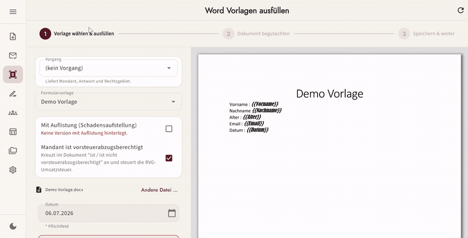
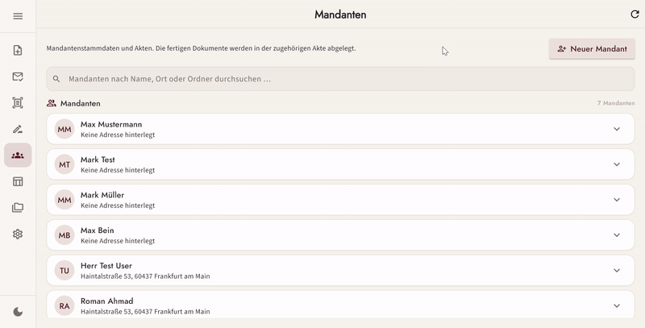
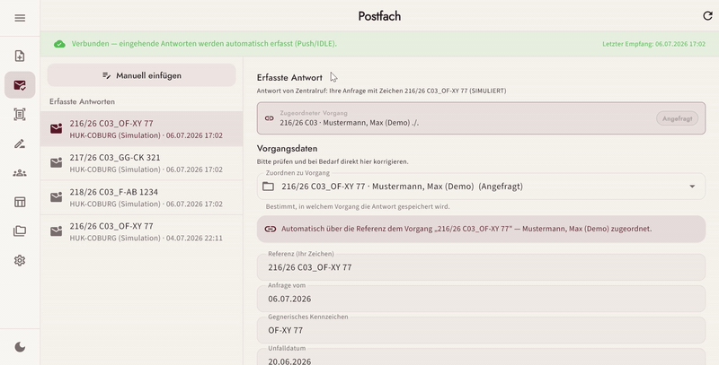
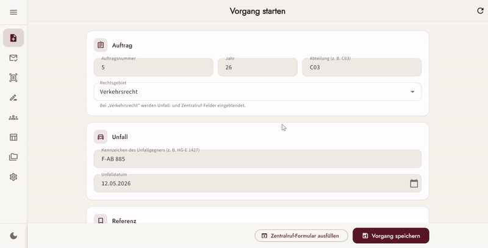
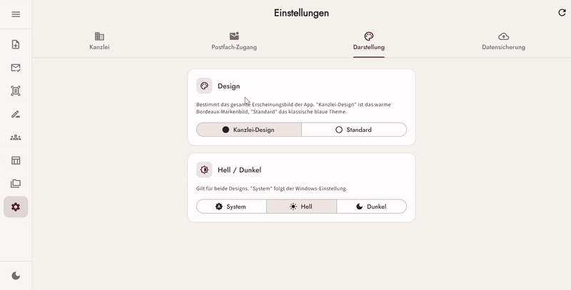
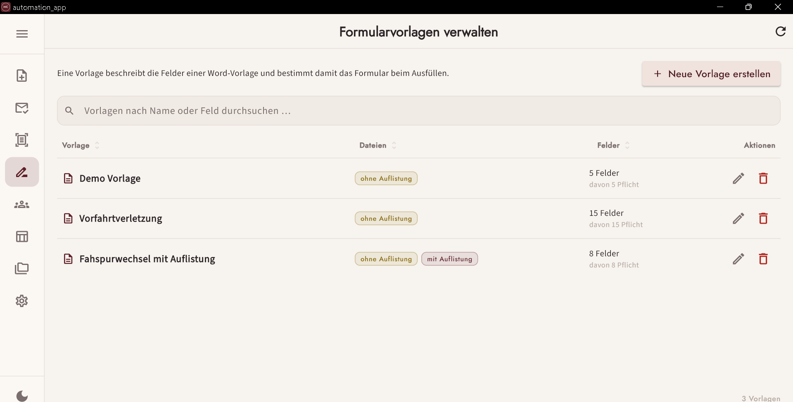
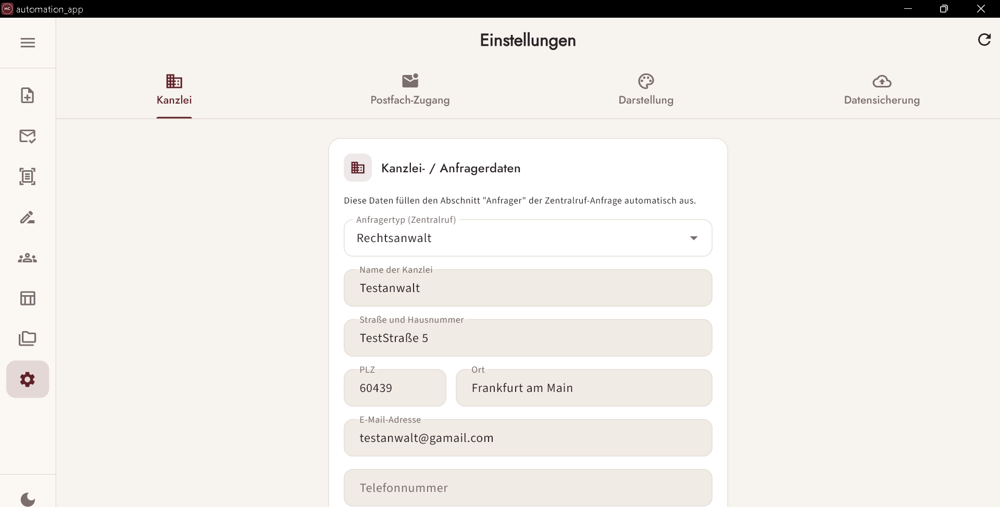

# Office Automation App

[](https://github.com/Romanahmad32/flutter_automation_app/actions/workflows/ci.yml)

A cross-platform **Flutter desktop app** (Windows, Linux, macOS) that automates repetitive office paperwork in a law-firm-style workflow: filling Word templates, managing client records, and monitoring a mailbox for incoming requests — so routine documents are generated in seconds instead of minutes.

Works together with its .NET backend: [AutomationService](https://github.com/Romanahmad32/AutomationService) (REST + SignalR, runs on `localhost:5143`).



## Demo

| | |
|---|---|
| **Client management (Mandanten)** — search, create and edit client records with their case files |  |
| **Mailbox monitoring** — incoming replies are captured live (IMAP push) and their data is extracted into structured fields |  |
| **Zentralruf autofill** — start a case, and the insurance inquiry form in the browser is prefilled automatically |  |
| **Theming** — light/dark mode with persisted preferences |  |

**Template management** — reusable Word templates with their detected placeholder fields:



**Settings** — firm data used to prefill the Zentralruf request form:



*All names, addresses and case numbers shown are test/dummy data.*

## Features

- **Word automation wizard** – multi-step flow that detects placeholders in Word templates and fills them from structured form data
- **Form template setup** – manage reusable templates and map their placeholders to form fields
- **Client management (Mandanten)** – create and browse client records, backed by a local file-system data source
- **Mailbox monitoring** – live inbox updates over SignalR, with automated parsing of e-mail responses
- **Zentralruf request & reply** – prefill insurance inquiry forms and parse the replies automatically
- **Theming & settings** – light/dark themes with persisted user preferences

## Architecture

The project follows **Clean Architecture**, split per feature into `data / domain / presentation` layers:

- **State management:** BLoC / Cubit (`flutter_bloc`)
- **Dependency injection:** `get_it` + `injectable` (code-generated)
- **Navigation:** `auto_route`
- **Forms:** `reactive_forms`
- **Networking:** `dio` (REST) + SignalR client for live updates
- **Models:** `freezed` + `json_serializable`

```
lib/
├── core/          # DI, router, network, theming, shared widgets
└── features/
    ├── word_automation/
    ├── form_template_setup/
    ├── mandanten/
    ├── mailbox/
    ├── zentralruf_request/
    ├── zentralruf_reply/
    └── settings/
```

## Getting started

1. Start the backend: clone and run [AutomationService](https://github.com/Romanahmad32/AutomationService) (listens on `http://localhost:5143`)
2. Install dependencies and generate code:
   ```bash
   flutter pub get
   dart run build_runner build --delete-conflicting-outputs
   ```
3. Run the app:
   ```bash
   flutter run -d windows   # or: -d linux / -d macos
   ```

## Tests

```bash
flutter test
```

Unit tests cover the core business logic, e.g. placeholder matching, e-mail parsing and the local data sources.
